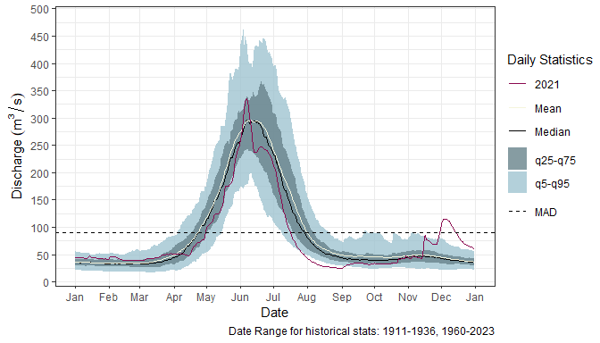
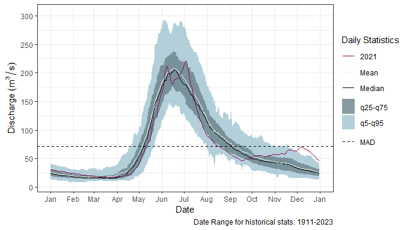
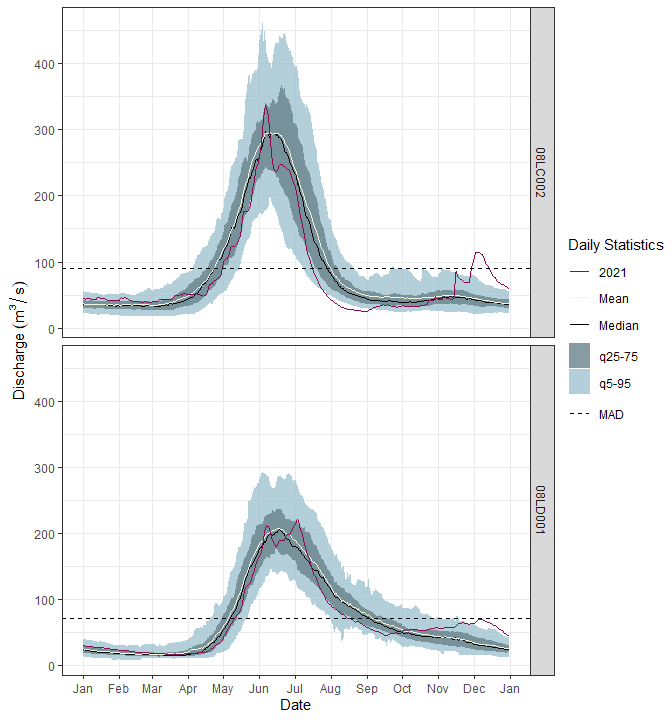

`hydroGraphR` is an R package designed to simplify the process of creating hydrographs that compare historical hydrometric data with a specific year's traces. This vignette provides an overview of the package's functionality and demonstrates how to use it in a typical workflow.

## Installation

To install the development version of `hydroGraphR` from GitHub:


``` r

# Install devtools if not already installed
#install.packages("devtools")

# Install hydroGraphR
#devtools::install_github("your-username/hydroGraphR")

library(hydroGraphR)

```

## Workflow Overview

The typical workflow for hydroGraphR involves the following steps:

1. Download hydrometric data for specific WSC stations.
2. Generate single-year and historical statistics.
3. Visualize the data by creating hydrographs.

### Step 1: Download Hydrometric Data

Use the `dl_hydro()` function to download data for specific Water Survey of Canada (WSC) station numbers. You can find station numbers on the WSC [website](https://wateroffice.ec.gc.ca/search/real_time_e.html). 

You may also assign nicknames to stations for easier identification in subsequent analyses. Ensure that the number of nicknames matches the number of station numbers. 

Examples:


``` r
#example of station(s) download without nicknames
hydro_data <- dl_hydro(station_number = c("08LD001", "08LC002"))

#example of station(s) download with nicknames. 
hydro_data_nickname <- dl_hydro(station_number = "08LD001", nick_name = "Adams River")
```

### Step 2: Create Statistics for Single Year and Historical Data

Once the hydrometric data is downloaded, you can calculate statistics for: 

- A specific year of interest (YOI) using `create_hydro_stats_singleYr()`.
- Historical data using `create_hydro_stats_historical()`. 

Stats can either be calculated and displayed in calendar year (Jan-Dec) or water year (WY) (Nov-Oct) format.

Max/min dates can also be selected for historical dates if focus is on a specific period. 

*Important Note:Data from the past two years may be provisional, as such should be used with caution*
<br><br><br>


``` r
all_hydro_sites_1yr <- create_hydro_stats_singleYr(hydro_data, YOI = 2021, WY = FALSE) # Calendar year
all_hydro_sites_hist <- create_hydro_stats_historical(hydro_data)

```

### Step 3: Create  Hydrographs

Visualize your data using one of two functions, depending on your preferred output style:

**Option 1**: `create_hydrogreaph_separate()`

- This function creates separate hydrographs as individual images which are ideal for standalone use or printing. 


``` r

create_hydrograph_separate(
  all_hydro_sites_hist,
  all_hydro_sites_1yr,
  parameter = "flow",
  output_type = "Print",
  WY = FALSE
)
```

<!-- --><!-- -->
<br><br><br>

**Option 2**: `create_hydrograph_faceted()`

- This function creates a singel faceted hydrograph, making it easy to compare multiple stations side by side. 


``` r

create_hydrograph_faceted(
  all_hydro_sites_hist,
  all_hydro_sites_1yr,
  parameter = "flow",
  WY = FALSE,
  output_type = "print"
)
```

<!-- -->


### Additional tools

You can combine these tools with other R packages to create streamlined workflows for hydrologic data analysis. For example, the `streamTrackR` package complements `hydroGraphR` by enabling easy comparison of current conditions across selected rivers.


### Summary

`hydroGraphR` simplifies hydrometric data analysis and visualization with functions for downloading data, generating statistics, and creating hydrographs. Whether working with individual rivers or a larger dataset, the package offers flexibility for both exploratory and presentation-ready outputs.

For further details, consult the package documentation
