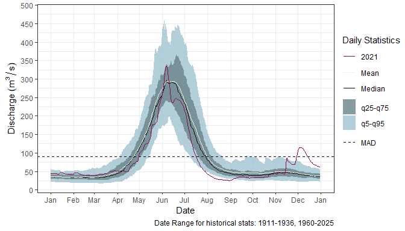
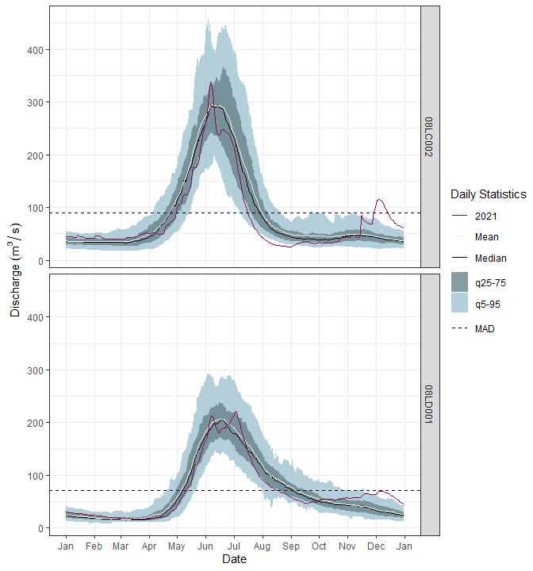

Introduction to hydroGraphR
================
Paula Soto<br>
2025-03-06

`hydroGraphR` is an R package designed to streamline the process of
visualizing hydrometric data by generating hydrographs that compare
historical water level or discharge statistics with a specific year’s
observed data. The package is particularly useful for hydrologists,
environmental scientists, and water resource managers who need to
analyze trends, seasonal variations, and anomalies in hydrological data.

This vignette provides an overview of the package’s key functionalities
and demonstrates its application in a typical workflow. Users can
leverage `hydroGraphR` to:

- Load and preprocess hydrometric data: The package supports various
  data formats and includes functions for cleaning, filtering, and
  formatting time series data.
- Compute historical statistics: It can calculate long-term percentiles,
  mean values, and other statistical summaries to establish a historical
  baseline for comparison.
- Generate hydrographs: Users can create clear and customizable plots
  that overlay the current year’s hydrometric data on historical trends,
  making it easy to identify deviations or anomalies.
- Customize scales: The package provides fine-tuned control over axis
  scaling and time period selection, allowing users to adjust date
  ranges and data visualization as needed.

By automating many of the repetitive tasks involved in hydrograph
creation, hydroGraphR enhances efficiency and consistency in
hydrological data analysis. The following sections will guide you
through its core functionality with step-by-step examples.

## Installation

To install the development version of `hydroGraphR` from GitHub:

``` r
# Install devtools if not already installed
install.packages("devtools")

library(devtools)

# Install hydroGraphR
install_github("pausoto7/hydroGraphR")

# Download library
library(hydroGraphR)
```

## Workflow Overview

A typical workflow for hydroGraphR involves the following steps:

1.  Download hydrometric data for specific WSC stations.
2.  Generate single-year and historical statistics.
3.  Visualize the data by creating hydrographs.

### Step 1: Download Hydrometric Data

Use the `dl_hydro()` function to download data for specific Water Survey
of Canada (WSC) station numbers. You can find station numbers on the
[WSC website](https://wateroffice.ec.gc.ca/search/real_time_e.html).
Note that with this function historical and real time data will be
downloaded. Typically, historical data has been QAQC’d and occurred
longer than two years ago. Real time data is data collected within the
last two years and **has not** been QAQC’d. 

You may also assign nicknames to stations for easier identification in
subsequent analyses. If you are going to use nicknames ensure that the
number of nicknames matches the number of station numbers.

Examples:

``` r
#example of station(s) download without nicknames
hydro_data <- dl_hydro(station_number = c("08LD001", "08LC002"))

#example of station(s) download with nicknames. 
hydro_data_nickname <- dl_hydro(station_number = "08LD001", nickname = "Adams River")
```

### Step 2: Create Statistics for Single Year and Historical Data

Once the hydrometric data is downloaded, you can calculate statistics
for:

- A specific year of interest (YOI) using
  `create_hydro_stats_singleYr()`.
- Historical data using `create_hydro_stats_historical()`.

Statistics calculated are listed in more detail in Step 3.

WY is a logical value indicating whether to present hydrograph by water
year (Nov-Oct) (TRUE) or calendar year (Jan-Dec) (FALSE). For more
information on water years, see
[here](https://www.ausableriver.org/blog/what-water-year#:~:text=Hydrologists%20measure%20time%20differently%20than,known%20as%20a%20water%20year.).

Max/min dates can also be selected for historical dates if focus is on a
specific period. For example, you could enter date_minimum =
“2010-01-01”, date_maximum - “2019-12-31” and YOI = 2020 if you wanted
to compare 2020 with the 2010’s.

***Important Note: Data from the past two years may be provisional, as
such should be used with caution when a recent YOI is selected. Status
of data can be found on the WSC website.***

<br>

``` r
all_hydro_sites_1yr <- create_hydro_stats_singleYr(hydro_data, 
                                                   YOI = 2021, 
                                                   WY = FALSE) # Calendar year

all_hydro_sites_hist <- create_hydro_stats_historical(hydro_data) # Use all available hydrometric data
```

### Step 3: Create Hydrographs

Visualize your data using one of two functions, depending on your
preferred output style.

- `create_hydrograph_separate()`- Generates individual hydrographs for
  each station.

- `create_hydrograph_faceted()` - Creates a single faceted plot
  displaying multiple stations together.

Variables shown on hydrograph legends are described here:

<table class="table table-condensed" style>
<thead>
<tr>
<th style="text-align:left;">
Term
</th>
<th style="text-align:left;">
Definition
</th>
</tr>
</thead>
<tbody>
<tr grouplength="1">
<td colspan="2" style="border-bottom: 1px solid;">
<strong>YOI</strong>
</td>
</tr>
<tr>
<td style="text-align:left;padding-left: 2em;" indentlevel="1">
Mean
</td>
<td style="text-align:left;">
The recorded mean discharge or water level for each day.
</td>
</tr>
<tr grouplength="3">
<td colspan="2" style="border-bottom: 1px solid;">
<strong>Historical</strong>
</td>
</tr>
<tr>
<td style="text-align:left;padding-left: 2em;" indentlevel="1">
Mean
</td>
<td style="text-align:left;">
The long-term mean discharge or water level for each day, based on
historical data.
</td>
</tr>
<tr>
<td style="text-align:left;padding-left: 2em;" indentlevel="1">
q25-q75
</td>
<td style="text-align:left;">
The interquartile range (q25–q75) of the data distribution, representing
the middle 50% of values, where q25 is the 25th percentile and q75 is
the 75th percentile.
</td>
</tr>
<tr>
<td style="text-align:left;padding-left: 2em;" indentlevel="1">
q5-q95
</td>
<td style="text-align:left;">
The 5th–95th percentile range (q5–q95) of the data distribution,
capturing 90% of observed values, where q5 is the 5th percentile and q95
is the 95th percentile.
</td>
</tr>
<tr>
<td style="text-align:left;">
MAD
</td>
<td style="text-align:left;">
Mean Annual Discharge, a measure of the average amount of discharge
through a river or stream over the course of a year.
</td>
</tr>
<tr>
<td style="text-align:left;">
Date Ranges
</td>
<td style="text-align:left;">
The years during which the data was collected and included in analysis.
</td>
</tr>
</tbody>
</table>

#### Parameters

Below is a list of the input parameters for the functions, along with
their expected values:

- **parameter**: Options are `"flow"` for a discharge hydrograph, and
  `"level"` for a water level hydrograph.

- **WY**: Logical value indicating whether to present hydrograph by
  water year (Nov-Oct)(`TRUE`) or calendar year (Jan-Dec)(`FALSE`). For
  more information on hydrologic water years see
  [here](https://www.ausableriver.org/blog/what-water-year#:~:text=Hydrologists%20measure%20time%20differently%20than,known%20as%20a%20water%20year.).

  - Note:**Ensure that the water year (WY) choice matches the selection
    made in Step 2.** For example, if “calendar year” was chosen for
    statistics in Step 2, it must also be selected for the hydrograph
    presentation. Selecting a different year type will result in missing
    data on the hydrograph and trigger a warning.

- **output_type**:

  - `"print"` will print your image in R, useful for embedding in
    rmarkdown or shiny type outputs.
  - `"jpeg"` will produce a jpeg image and save it to the “figures/”
    folder of your project.

<br>

#### **Option 1**: `create_hydrograph_separate()`

- This function creates separate hydrographs as individual images which
  are ideal for standalone use or printing. When the “jpeg” option is
  selected in this option, an additional title will appear on the image
  with the station name to avoid confusion of station ID if the file
  name is not easily available (for example if the image is pasted into
  a word document).

``` r

create_hydrograph_separate(
  all_hydro_sites_hist,
  all_hydro_sites_1yr,
  parameter = "flow", # Discharge hydrograph
  output_type = "print",
  WY = FALSE # calendar year
)
```

<!-- --><!-- -->
<br><br><br>

#### **Option 2**: `create_hydrograph_faceted()`

- This function creates a single faceted hydrograph, making it easy to
  compare multiple stations side by side. There are a few additional
  variabels that can also be modified in this function:

  - `fixed_y_scales`: A character string specifying whether the y-axis
    scale is “fixed” or “free” across facets. Defaults to “fixed”.
  - `custom_ymax_input`: A numeric value for a custom maximum y-axis
    value. Leave as NA for automatic ymax.
  - `custom_ymin_input`:A numeric value for a custom minimum y-axis
    value. Leave as NA for automatic ymin.
  - `jpeg_width`: A numeric value specifying the width of the figure (in
    inches) for JPEG output. 6 inches is automatic output.  
  - `jpeg_height`: A numeric value specifying the height of the figure
    (in inches) for JPEG output. 8 inches is automatic output.

``` r

create_hydrograph_faceted(
  all_hydro_sites_hist,
  all_hydro_sites_1yr,
  parameter = "flow",
  WY = FALSE, # calendar year
  output_type = "print", 
  fixed_y_scales = "fixed",
  custom_ymax_input = NA, 
  custom_ymin_input = NA
)
```

<!-- -->

### Additional tools

You can combine these tools with other R packages to create streamlined
workflows for hydrologic data analysis. For example, the `streamTrackR`
package complements `hydroGraphR` by enabling easy comparison of current
conditions across selected rivers.

### Summary

`hydroGraphR` simplifies hydrometric data analysis and visualization
with functions for downloading data, generating statistics, and creating
hydrographs. Whether working with individual rivers or a larger dataset,
the package offers flexibility for both exploratory and
presentation-ready outputs.

For more information, please email <Paula.Soto@dfo-mpo.gc.ca>
